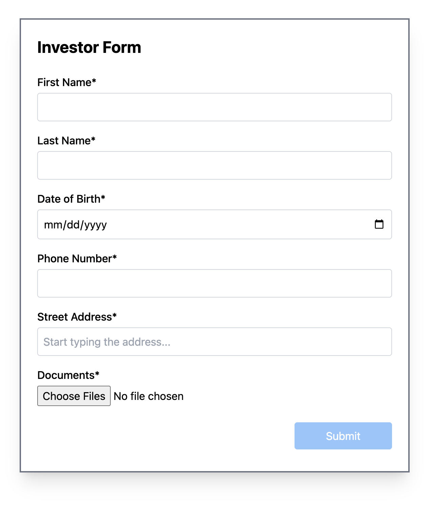
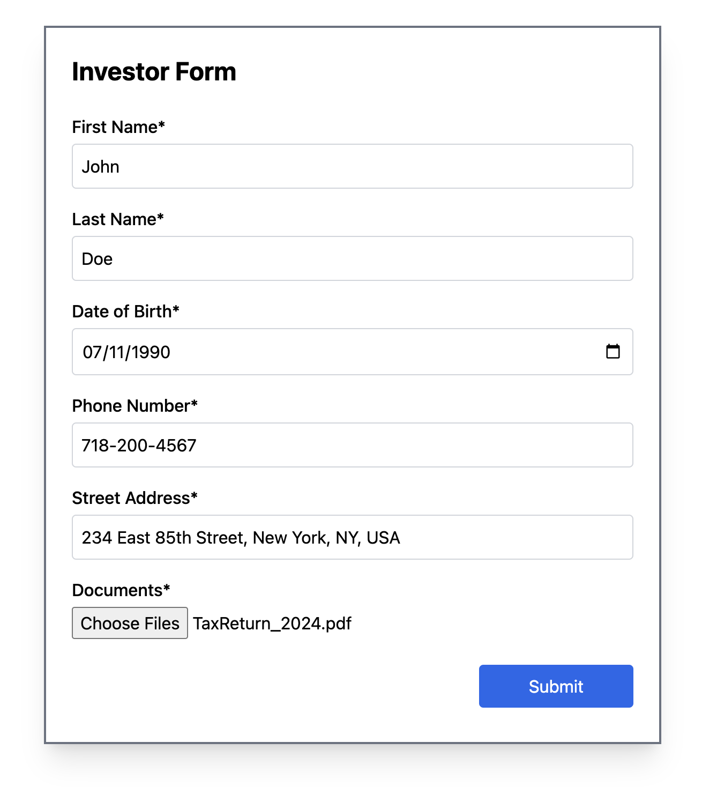
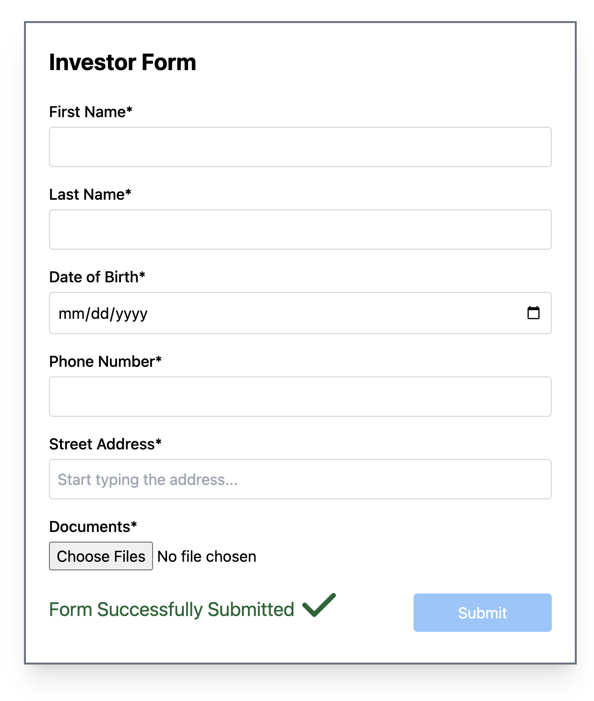

# Investor-Form App

A full-stack web application to collect investor data and document uploads. Built with React, Express, SQLite, and Tailwind CSS.

---

## Features

- Google Places Autocomplete for addresses
- Multiple file uploads
- SQLite storage for investors and documents
- Tailwind CSS styling
- FontAwesome feedback icons
- Form clears automatically after successful submission

---

## Tech Stack

- **Frontend**: React + Tailwind CSS
- **Backend**: Node.js + Express
- **Database**: SQLite
- **File Uploads**: Multer
- **Autocomplete**: Google Places API

---

## Setup Instructions

### 1. Clone the repo

```bash
git clone https://github.com/aleksei-naumov/investor-form.git
cd investor-form
```

### 2. Install dependencies

```bash
# Install server dependencies
npm install

# Install frontend dependencies
cd frontend
npm install
```

### 3. Add Google API key

Create a `.env` file in `frontend/` with:

```env
REACT_APP_GOOGLE_API_KEY=google_api_key
```

- API_KEY was emailed along with the repo link

### 4. Run the app locally

In two terminals:

```bash
# Terminal 1 - backend
npm run server

# Terminal 2 - frontend
cd frontend
npm start
```

App will be running at [http://localhost:3000](http://localhost:3000)

---

## API

### `POST /api/investors`

Saves investor data and uploaded files.

**Body (multipart/form-data):**

- `first_name`
- `last_name`
- `date_of_birth`
- `phone_number`
- `street_address`
- `state` (auto-parsed)
- `zip_code` (auto-parsed)
- `documents[]`: up to 10 files, 3MB each

**Response:**

- `200 OK` if saved
- `400` if fields/files are missing
- `500` on DB error

---

## Using the SQLite CLI

From the investor-form project root:

```bash
# Launch the SQLite shell
sqlite3 database.sqlite
```

At the `sqlite>` prompt, run:

```sql
.tables
-- lists existing tables: investors, documents

.headers on
.mode column

SELECT * FROM investors;
SELECT * FROM documents;
```

To exit:

```sql
.quit
```

## Empty Form



## Form with data



## Submitted form



---

## TODO

- [ ] Add `/api/investors` GET route to fetch all investor records with associated documents
- [ ] Display submitted investors below the form, with live updates after each submission
- [ ] Add form validation and error highlighting (e.g. missing fields, invalid phone/email)
- [ ] Show upload progress indicator for large file upload
- [ ] Replace console error/warn handling with visible UI messages
- [ ] Add document preview (PDF/image) support
- [ ] Sort or filter investors by name, date, or zip code
- [ ] Enable editing (pre-filled form) or deleting investor records (set hidden flag: true) and hide related documents.
- [ ] Add tests for backend routes and form logic
- [ ] Implement **bulk investor submission** via CSV or JSON upload
